# JAR API Generate Template

This template shows how to generate code from an API. Typically to create a client or to create a server by implementing generated interfaces.

```mermaid
flowchart TB
    %% Repository
    repo[("🏛️ Repository<br/><small>Maven</small>")]:::repo
    
    %% Applications
    app1["🖥️ REST Application A<br/><small>Implements API</small>"]:::server
    app2["🖥️ REST Application B<br/><small>Consumes API</small>"]:::client

    %% Usage flow
    repo -->|"☕ OpenAPI Spec"| app1
    repo -->|"☕ OpenAPI Spec"| app2
    
    %% Integration flow
    app2 -.->|"🔗 HTTP API calls"| app1

    %% Styling
    classDef repo fill:#e8f5e8,stroke:#2e7d32,stroke-width:3px,color:#000
    classDef server fill:#fff8e1,stroke:#f57f17,stroke-width:2px,color:#000
    classDef client fill:#e3f2fd,stroke:#1976d2,stroke-width:2px,color:#000
```

## Gradle

This is much like [template-jar](https://github.com/Forsakringskassan/template-jar) but also uses `se.fk.gradle.openapi-generate` plugin from [gradle-conventions](https://github.com/Forsakringskassan/gradle-conventions).
